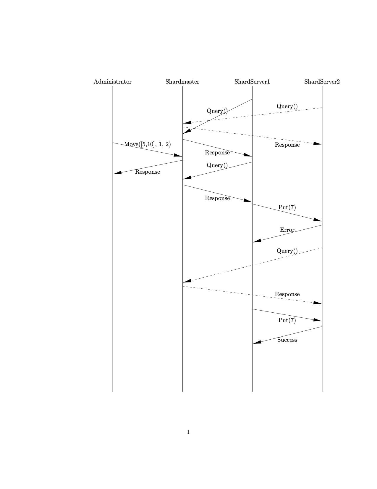
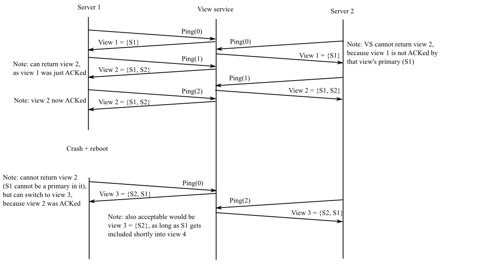

# Clouds Project - EURECOM FALL 2022


## System Overview

EUREBOOK is a simple social network that allows to connect people at EURECOM.
From the technical point of view the system is divided into two parts: a frontend system and a backend system.
The frontend system provides the UI that allows the user to interact with the backend system, sending request to the server through Remote Procedure Call (RPC).
You do not need to know the details of the frontend system, as the implementation is already provided.


The backend system allows to store and managing the request coming from the user.
The backend is made of three main components: **shardmaster**, **shardmanager**, **shardserver**.
The Figure above shows the interacton between the components. 
The system stores data in form of key-values pairs. 
It allows to insert a new user and storing the information as key-value pair < **userID** &rarr; **userName** >. 
A user can insert posts, and these are stored as < **postID** &rarr; **Text** >.

* **SHARDMASTER**: <br>The role of the shardmaster is to assign to each shardmanager joining the systems the range of keys to store. The range of keys assigned to a shardmanager evolves dynamically in time. Every time a server joins the system, the shardmaster splits the total key range in intervals of same size. We call this key range **shard**. For example, let us assume that the maximum key the system can store is 1000. If three shardmanagers join the system, the first shardmanager will be in charge of storing the keys between [0-334], the second one the interval [335-667] and the last one [668-1000]. More details will follow in the next section.
* **SHARDMANAGER**: <br>The shardmanager is a simple gataway between the shardmanager and the shardserver. Its function is to abstract the shardservers behind, such that the shardmaster can see only one server in charge of a specific shard, while behind a shardmanager we can add more than one key-value server. In this project behind each shardmanager we will have two shardservers, a primary and a backup. Having two servers handling the same key range allows the system to resist to one failure per shard. The shardmanager has two main functions: forwarding the request coming from the client and detect if one of the servers assigned to him is still running.
* **SHARDSERVER**: <br>The shardserver stores the key-value entries and handle the requests coming from the client. It can be a _primary_ or a _backup_ server.

NOTE: This modular structure allows us to abstract from how we handle the fault tolerance in the system. While for this 
project we will rely on a simple primary backup mechanism, it can be extended with more complex protocols such as PAXOS 
or RAFT.

The following table, summarize the different C++ classes you will deel with during the project.

| Files                                             | Use                                                                                                          |
|---------------------------------------------------|--------------------------------------------------------------------------------------------------------------|
| `common/common.{cc, h}`                           | Contains useful function that will help you with the implementation. Feel free to add helper functions here. |
 | `protos/shardmaster.proto` `protos/shardkv.proto` | Protobufs for our RPC services.                                                                              |
| `config/` `repl/`                                 | Support code needed for the clients. **You should not use or modify these.**                                 |
| `shardmaster/shardmaster.{cc, h}`                 | Implement your shardmaster (assignment 1) here.                                                              |
| `shardkv_manager/shardkv_manager.{cc, h}`         | Implement your shardmanager (assignment 2 and 3).                                                            |
| `shardkv/shardkv.{cc, h}`                         | Implement your shardkv here (passignment 2 and 3).                                                           |
| `client/*.{cc, h}`                                | Clients for interacting with your shardmaster, shardmanager and shardkvs. **You should not modify these.**   |   |
| `test_utils/test_utils.{cc,h}` | Contains utility functions to help you write your own tests                                                  |

## Getting started
Go on your EURECOM gitlab and fork the following project GIT URL.
Once the repository is on your gitlab account, clone it locally on your laptop.

At this point you should see the directory `clouds-project-2022` structured as follows: 
<br>
```
+ clouds-project-2022
    + backend-distributed-system
        + backend
        + clouds-build-docker
        + clouds-run-docker
        + Dockerfile.clouds.project
    + frontend-system
        + frontend
        + frontend-system
        + docker-compose.yml
```

You will mainly work in the `clouds-project-2022/backend-distributed-system/backend` directory.

### Setup
First, download [Docker Desktop](https://www.docker.com/products/docker-desktop/) for your machine and run it. It allows to create docker images and run them in containers.

##### Note: Docker Desktop must be active in order to use containers

Then, build the docker image described in the Dockerfile. 
At this point, you can create a container and access it.<br>

To build the docker image, go in `clouds-project-2022/backend-distributed-system` directory and run the following script.
```
./clouds-build-docker
```
The first time you run this script it will require some time. <br>

After the image is built, you can run it on a container. You can use the following script: 
```
./clouds-run-docker
```
The first time you run `./clouds-run-docker`, it will create a new container and give you the access to it from command line. 
If you exit the container and run again the script you will access the same container created before.
To have a clean instance of the container, you can run the script with the flag `--clean`. This will destroy every existing container and create a new one for you.
```
./clouds-run-docker --clean
```
Once you run this script, you will be log in the home directory of your container `/home/clouds-user`.

If everything is correct so far, by typing `ls -l`, you should see the `backend` directory

### Build/Test

Once in the container, go in the `backend` directory and run the script `./install.sh`.

Then, go in `~/backend/build` and compile the executables using the makefile command `make -j 8`. It will require some time.

Finally, compile and run the tests by typing `make check`. It requires some time.

All tests should fail.

The previous command are summarized as follows:
```
cd ~/backend
./install.sh
cd build 
make -j 8
make check
```


### Development
The code is implemented entirely in C++ and runs in a container. The directory containing the code is mounted on a shared
directory between the container and the host. This allows you to modify the code in the host (your laptop) and see the 
changes in the container. 
As consequences, you can use an **IDE** for coding (for example CLion). However, in order to **run** and **debug** your 
solution it is necessary to log in the container and use the command line interface.

### Compiling
Once you modified a C++ class, you can compile it by running:
* `make -j 8` in the `build` directory
<br>or
* `make class-name` in the `build` directory, where `class-name` is the class you want to compile. For example, 
`shardmaster`, `shardmanager`, `shardkv`, etc.

The compiling of the shardmaster, shardmanager and shardkv classes will **automatically** generate the corresponding protofiles
(with extension pb.h/o, grpc.pb.h/o). This protofiles implement the logic to manage Remote Procedure Call described in the
files in `~/backend/protos/` directory.

#### Note: 
When you modify the header file of a class using the RPC calls (for example shardmaster, shardmanager, etc) be sure to 
delete any existing `.grpc.pb.h/p` and `.pb.h/o` file before to compile the class.


### Debugging with GDB
If you are already familiar with **gdb**, you can skip this section; otherwise, keep reading.
In order to debug a C/C++ code you can use **gdb** debugger. 
The procedure is the following. Go in the build directory and compile your code. <br> 
Then, run `gdb --args myprogram arg1 arg2`, where **gdb** is the debugger; the **--args** flag allows to specify for your
program the arguments it takes from command line; **myprogram** is the executable you want to debug and **arg1** and 
**arg2** are the arguments given to the executable. <br>
For example, if you want to debug the shardmaster -- which normally requires as parameters the _port number_ -- you can 
launch the following command:
```
gdb --args shardmaster 9095
```
If everything is correct you should read something like:<br>
_Reading symbols from ./shardmaster..._

Now, type `run` to the start the execution of the program.

At this point you have an interface in which you can specify some commands. Here the most useful ones:
* **break**: It allows to set a breakpoint. A breakpoint allows to stop the execution of a program in a specific "point". This point can be a line number in your code or a function. 
For example `b 45` will interrupt the execution at line 45. By default, the line number refers to the current file in execution. For example the shardmaster involves three files: main.cc, shardmaster.cc and shardmaster.h.
If you specify at the beginning only the line number, for example `b 45` the execution will stop at line 45 of the main.cc file. If you want to stop at line 45 in the **shardmaster.cc** file, you need to specify something like: `b shardmaster.cc:45`
* **run**: Run the program, whose execution is going to stop when the first breakpoint is met.
* **next**: It allows to move the execution one line at time. Assuming you are stuck at line 45, with **"next"** command you can move to the line 46 and then 47, and so on.
* **continue**: It resumes the execution of the program. You can use this command when you are stopped on a breakpoint and you want resume the execution without stopping until the next breakpoint or until the end of the program.
* **list**: Print 10 lines around (5 before and 5 after) the point in which the execution is stopped. 
* **print variable**: Print the value of a variable.

Please, note that these command are only a subset of the ones provided by **gdb**. You can look for more references online.

## Assignment
### Assignment 1 - Shardmaster

#### Overview
Every operation a client performs on the systems is expressed as key-value pair. In order to make the system scalable, 
the keys are partitioned in subsets a.k.a. **shards**. These shards are assigned to different servers. A client  -- in 
order to make a request for a given key -- needs to know which server to contact. 
To make this possible, we introduce a **shardmaster**, a controller who is in charge of: 
* distributing shards across servers;
* sending the configuration to the client who ask for it (a client for the shardmaster can be whoever ask for a 
configuration, i.e. shardservers, shardmanager, administrator, final user etc).

A **configuration** is a mapping between shards and servers.

Your first assignment consists in implementing a **shardmaster**. 

#### Specification 

Your shardmaster will organize data by partitioning the key-values pairs in **shards** and assigning these shards to the
**shardmanagers** available in the system.

All servers and clients in the systems communicate among each others through Remote Procedure Call (RPC). RPCs are a way
of making function or method calls between two processes (even if they’re on different machines!), typically without the
programmer having to specify exactly how that communication takes place. 

A client (for example an administrator) can use the `Join/Leave` RPCs to add/remove servers (shardmanagers). Both of 
these operations should cause the shardmaster to adjust how it has distributed shards – either giving the new 
shardmanager shards from an existing shardmanager, or redistributing the shards from a leaving shardmanager. Together 
with the `Query` RPC, this makes it possible for clients to adapt to a changing set of shardmanagers in the system, as 
the shardmaster can always tell clients what the most up-to-date configuration is.

The `Move` RPC transfers a shard between two servers and shouldn’t cause any other configuration changes. We will use it
to test your shardmaster.

Here’s a table of the RPCs your shardmaster should support (take a look at protos/shardmaster.proto to see the message 
specifications):

| Name  | Parameters                                                              | Behavior                                                                                                                                                                                                                                                                                      |
|-------|-------------------------------------------------------------------------|-----------------------------------------------------------------------------------------------------------------------------------------------------------------------------------------------------------------------------------------------------------------------------------------------|
| Join  | Address of a new shardmanager                                           | The shardmaster should add the server to the system and **redistribute** the keys keeping into account the new server                                                                                                                                                                         |
| Leave | Address of a shardmanager who is already in the system but is leaving   | The shardmaster should remove the server from the system and **redistribute** the keys keeping into account the server leaving.<br> Note: a server leaving doesn't mean that the server is shut down. You do not have to support the case in which a shardmanager fails without doing a leave | 
| Move  | The shard to move and the server address to which the shard is assigned | Updates the shardmaster’s configuration to assign the specified shard to the specified server. This shouldn’t cause any other changes to how shards are distributed.                                                                                                                          | 
| Query | None                                                                    | Returns the current distribution of shards across key-value shardmanagers..                                                                                                                                                                                                                   |

##### Redistribution
We’ve alluded to this in our explanation of the `Join` and `Leave` RPCs, but how exactly should the redistributing shards work?
Every key handled by our servers are associated with an integer value, that we call keyID.
This keyID is included in the range [MIN_KEY, MAX_KEY]. We assume that we cannot have keyIDs outside this interval.
The redistribution must be the following. Every time a shardmanager Join or Leave the system, [MIN_KEY, MAX_KEY] range 
will be divided in equal sub-intervals across all the shardmanagers available.
If the keys do not evenly distribute, we distribute the remaining across the shardmanager who joined first.
Finally, the Move RPC extract a shard from one server and assign it to another one. However, the redistribution after 
every Join/Leave ignore every previous Move.
Below is an example of how that works.

##### Redistribution Example
Let's say the ids used in our keys range from 0 to 100. A server running on `archer:4000` joins. At this point, our shardmaster configuration should look like this.

| KV Server	| Shards |
| ----------| -------|
| `archer:4000` |	[0, 100] |

Now, let’s say we get two more servers joining, `kirk:9999` and `sisko:713`. When `kirk:9999` joins, our shardmaster should look like this:

| KV Server	      | Shards     |
|-----------------|------------|
| `archer:4000` | 	[0, 50]   |
|  `kirk:9999`  | 	[51, 100] |


Now when `sisko:713` joins, our shardmaster must now partition our keyspace into three, giving us:

| KV Server	      | Shards     |
|-----------------|------------|
| `archer:4000` | 	[0, 33]   |
| `kirk:9999`   | 	[34, 67]  |
|  `sisko:713`  | 	[68, 100] |


Now lets say that `kirk:9999` leaves then rejoins. After it leaves, we have:

| KV Server	| Shards |
| ----------| -------|
|`archer:4000`|	[0, 50]|
|`sisko:713`	|[51, 100]|

and when it rejoins we get:

| KV Server	| Shards |
| ----------| -------|
|`archer:4000`|	[0, 33]|
|`sisko:713`	|[34, 67]|
|`kirk:9999`|	[68, 100]|


Now let’s walk through an example with Move. Let’s say `archer:4000`, `sisko:713`, and `kirk:9999` join (in that order), and we get:

| KV Server	| Shards |
| ----------| -------|
| `archer:4000`	|[0, 33]|
| `kirk:9999`	|[34, 67]|
| `sisko:713`	|[68, 100]|


Now, we move [20, 55] to `sisko:713`, giving us:

| KV Server	      | Shards |
|-----------------| -------|
| `archer:4000` |	[0, 19]|
| `kirk:9999`	  |[56, 67]|
|  `sisko:713`	 |[20, 55] [68, 100]|

Now, if `janeway:1234` joins, we get:

| KV Server	        | Shards |
|-------------------| -------|
|  `archer:4000`	 |[0, 25]|
| `kirk:9999`     |	[26, 50]|
| `sisko:713`	    |[51, 75]|
| `janeway:1234`	 |[76, 100]|

As you can see, the redistribution ignores any previous moves that were made. If instead of `janeway:1234` joining `sisko:713` left, we’d instead have:

| KV Server	| Shards |
| ----------| -------|
|`archer:4000`|	[0, 50]|
|`kirk:9999`|	[51, 100]|


Once again, the prior move was ignored.

#### Task
1. Complete the definition of the `StaticShardmaster` class (in `~/backend/shardmaster/shardmaster.h`) to include the 
fields necessary for the shardmaster to keep track of its servers. Remember to consider thread safety!
2. Modify the StaticShardmaster class (in `~/backend/shardmaster/shardmaster.c`) to support the RPCs described in the table above.

Once you are done with this task, you should be passing the `shardmaster_tests` tests!

**Note:**
* You will find a more detailed description of the RPC in the code.
* Make sure not to mutate C++ data structures while iterating over them as this is undefined behavior.
* You may want to keep track of the order in which the sharmanagers join the systems
* Move RPCs might not move entire existing shards. For example, we might have a server A that is responsible for the 
shard [0, 100]. If we move [25, 75] from A to server B, A should be left with the shards [0, 24] and [76, 100] while B 
contains [25, 75]. Moves might also transfer keys that are distributed on two different servers – think about edge cases!

**Note:**
When you modify the header file of the shardmaster (shardmaster.h) by adding variables to the class, delete all 
protofiles (files with extenstion .pb.h/o and .grps.pb.h/o) previously generated before you compile it.


#### Testing with a client

The client you’ll use to test this part is `clients/client`. The client can invoke all the RPCs specified in the above 
table on your shardmaster (run help for the commands you need), as well as three new RPCs: `Get/Put/Append` (you can 
ignore them for the moment).

This client initially queries the shardmaster for its current configuration of how shards are distributed among shardmanagers, then directly makes each RPC call on whatever shardmanager the shardmaster said has the key in question.
Remember, if the configuration of shards has changed you may need to query the shardmaster for the updated configuration to find keys!

To run a **shardmaster** and **client** (from the `build` folder):<br><br>

```
./shardmaster <PORT>
```

```
./client <SHARDMASTER_HOST> <SHARDMASTER_PORT>
```

##### Example 
In order to test the shardmaster, open three different terminals in your laptop and run in each of them the following script:<br> 
`./clouds-run-docker` <br><br>

**Terminal 1**: runs shardmaster on port 13100
```
./shardmaster 13100
```

**Terminal 2**: which connects to the shardmaster and then joins two shardmanagers:
```
./client `hostname` 13100
join first_server_address:1234
join second_server_address:8271
query
Shard {0, 500} on server first_server_address:1234
Shard {501, 1000} on server second_server_address:8271
```
**Note:**
You can provide fake addresses in your Join/Leave commands – the client doesn’t actually verify if key-value servers are
running on the addresses until you try to Get/Put/Append. 
This means you can test your id redistribution without updating your key-value servers (the next part!).

### Assignment 2 - Shardmanager & Key-Value Servers 

#### Introducing EUREBOOK
In this part of the assignment, you’ll write the implementation of **shardmanager** and **key-value server** for the new
social media platform, EUREBOOK. On EUREBOOK, users can choose their names and create posts on their timelines. 
Surprisingly, these timelines are very similar to “walls” on Facebook! Even though there can be multiple users with 
same usernames, every `user_id` is unique. 
The same goes for posts: even though there can be multiple posts with the same text, every post has a unique `post_id`.

**Note:** 
User_id and post_id must be in the following format: "post_" + "N" and "user_" + "N", where N is a positive integer.
For example `user_43` or `post_65`.

#### Shardmanager
Your first task is to implement a simple master server, called **shardmanager**.
The shardmanager acts as a proxy server behind which the key-value server is hidden.
It can receive `Ping` requests from any key-value server in the system (see later). However, only the first key-value server sending 
the `Ping` request will become the primary server associated to that **shardmanager**. All other Ping requests (from the 
same server or from different servers will be ignored for the moment). 

Your shardmanager can also receive Get, Put, Append or Delete RPCs. In this case, it will simply forward these requests
to the key-value server assigned to it and wait for the answer.

| 	Name      | Arguments                                                                  | Behavior                                                                                                                                                      |
|-----------------|----------------------------------------------------------------------------|---------------------------------------------------------------------------------------------------------------------------------------------------------------|
| Ping | Name of the server who makes the request. Ignore other fields until part 3 | Answer back with the name of the shardmaster. Ignore other fields. Note: the Ping RPC also includes an id and backup field. You can ignore them until part 3. |
| Get, Put, Append and Delete| Same arguments of the PRC request received                                 | Simply forward to the key-value server assigned                                                                                                               | 

#### Task
Complete the definitions of Get, Put, Append, Delete and Ping RPCs in the `ShardkvManager` class (`~/backend/shardkv_manager/shardkv_manager.h/cc`). 
More specifically:
1. When it receives a Ping from a key-value server, it will:
   * save locally the address stored in the **primary** field (see the Ping request declaration in the protos/* directory)
   of a Ping request message.
   * answer back by storing the shardmaster address in the **shardmaster** field of the Ping response.
2. When it receives Get, Put, Append and Delete from the client, it will forward the requests to the address of the 
key-value server that it got with the first Ping request.  

#### Key-Value Server
Let's now move on the implementation of key-value server.
The key-value server is resposible for storing the data in the system. It communicates only with the shardmaster and shardmanager.
When first the key-value server enter the system, it sends a Ping request to the **shardmanager**. It will receive in response
the name of **sharmaster** to query in order to get a key range configuration.  

Your key-value server must support the following RPC.
| 	Name      | Arguments                                                                           | Behavior                                                           |
|-----------------|-------------------------------------------------------------------------------------|--------------------------------------------------------------------|
| Get | A key | Returns associated value, or an error if the key is not present. |
| Put | A key and the associated value | Maps the specified key to the specified value, overwriting any previous value. Note: the Put RPC also includes a user field. You can ignore this value until part 2. |
| Append | A key and a value | Appends the specified value to the previously existing value for the given key. If the key wasn’t present, this call should be equivalent to a Put. |
| Delete | A key | Deletes the key-value pair with the specified key |


#### Specification

In EUREBOOK, there are four kinds of key-value pairs.

| Key-Value Pair Structure	                                 | Example Return Value                              |
|-----------------------------------------------------------|---------------------------------------------------|
| `user_id` &rarr; name                                     | 	 “user_14” &rarr; “malte”                        |
| `post_id` &rarr; post text                                | 	  “post_59” &rarr; “Hello, I am using EUREBOOK”  |
| `all_users` &rarr; comma-separated list of `user_id`s     | 	  “all_users” &rarr; “user_13,user_14,user_160,” |
| `user_id_posts` &rarr; comma-separated list of `post_id`s | 	 “user_14_posts” &rarr; “post_59,post_1,”        |

You’ll now write the key-value server called **shardkv** (see the shardkv directory for the stencil).
Your server should allow the following:
1. The put RPC includes a user field that stores the user’s ID. This is used in the case the put is for a post. 
The shardkv server should handle appending the new post ID to the `user_id_posts` key. The key might not be on this server!
2. We want to be able to query all the users currently in the system so users can make new friends! 
Automatically add a new `all_users` key on each server that keeps track of the user IDs of every user being stored on that server. 
Think about what other functions you’ll need to modify to keep this list up to date!

**Note**: You may notice that even though the shardkv server appends the `post_id` to `user_id_posts` on the post’s Put RPC, 
there isn’t a similarly efficient mechanism to delete that post ID from the list on a Delete RPC for the post. 
In EUREBOOK and many similar social media sites, deletes are much less common than puts, so it is acceptable to eat the 
cost of manually retrieving and updating `user_id_posts` on the client side.

##### Applying configuration changes to the key-value servers

So far, the shardmaster looks nice, but it doesn’t actually move keys between key-value servers. 
In other words, we haven’t touched on how the key-value servers handle configuration changes. 
If a subset of ids on server1 gets moved to server2, somehow we need to send the key-value pairs stored previously on server1 to their new home!

Your key-value store should now:

Periodically query the shardmaster (the server get the name after the first Ping RPC) for the current configuration of shards. 
If your server sees that shards it previously stored are now on another server, 
it should use the Put RPC to transfer the appropriate key-value pairs and cease to serve the shards after the transfer completes.
Only respond to queries for keys that it handles as per its last contact with the shardmaster, and return an error for all other keys.
When transferring data from one shardkv server to another via Put RPCs, 
it’s important to retry until success (grpc::Status::OK) – we don’t want key-value pairs to be lost! 
The diagram in the walkthrough below shows an example of why this is important.

##### Example


In the above diagram, both shardkv servers query the shardmaster and get the current configuration of shards. 
A client (administrator) then sends a Move request, moving the shard [5, 10] from Shardkv1 to Shardkv2.
Let's say that Shardkv1 has data for the key 7, which is in the moved shard.

When Shardkv1 queries the shardmaster for the second time, it notices that it is no longer responsible for the shard [5, 10]. 
Consequently, Shardkv1 attempts to transfer the data for key 7 to Shardkv2 via a Put RPC. 
However, Shardkv2 has not yet queried the shardmaster, so it is unaware that it is now responsible for keys in the range [5, 10]. 
However, Shardkv2 realizes that it is responsible for key 7 the next time it queries the shardmaster, which means that Shardkv1’s next Put RPC will succeed.

#### Task
1. Complete the definition of the ShardkvServer class (in shardkv/shardkv.h) to include the fields necessary for your server. 
Your implementation should include a key-value store, but now you will also need to keep track of the server’s assigned shards from the shardmaster.
2. Modify the ShardkvServer class (in shardkv/shardkv.cc) to support the RPCs Get, Put, and Append. 
You should now also implement QueryShardmaster, which should query the shardmaster for the distribution of keys and 
PingShardmanager to be assigned to the shardmanager.

#### Hints:
* Pay attention to not hold locks while a thread/server performs blocking operations, i.e. (sending keys to others server during a configuration change) 

At the end of this part, you should pass shardmaster_tests, shardkv_tests and integrated_tests. 

#### Testing with a client

In addition to the tests, you can test the system with clients.

Run in 6 different terminal on your laptop the clouds-run-docker script and once in the container go in `~/backend/build.`

In each terminal, run a different server:

**Terminal 1**: Shard Master

`./shardmaster <PORT>`

**Terminal 2:** Shard Manager

`./shardmanager <PORT> <SHARDMASTER HOSTNAME> <SHARDMASTER PORT>`

**Terminal 3:** Another Shard Manager

`./shardmanager <PORT> <SHARDMASTER HOSTNAME> <SHARDMASTER PORT>`

**Terminal 4:** Shard Key-Value Server

`./shardkv <PORT> <SHARD MANAGER HOSTNAME> <SHARD MANAGER PORT>`

**Terminal 5:** Another Shard Key-Value Server

`./shardkv <PORT> <SHARD MANAGER HOSTNAME> <SHARD MANAGER PORT>`

**Terminal 6:** Client (system administrator)

`./client <SHARDMASTER_HOST> <SHARDMASTER_PORT>`

From terminal 6, send requests. Type help to get the list of possible commands

**Note:** Read carefully and do not exnahge shard-master with shard-manager

#### Example

Assuming that containers'ID is `ad1f9a89b50f`:

**Terminal 1**: Shard Master

`./shardmaster 9095`

**Terminal 2:** First Shard Manager

```
./shardmanager 12000 `hostname` 9095
```

**Terminal 3:** Second Shard Manager 

```
./shardmanager 13000 `hostname` 9095
```

**Terminal 4:** First Shard Key-Value Server
```
./shardkv 12111 `hostname` 12000
```

**Terminal 5:** Second Shard Key-Value Server
```
./shardkv 13111 `hostname` 12000
```

**Terminal 6:** Client (system administrator)
```
./client `hostname` 9095
join ad1f9a89b50f:12000
join ad1f9a89b50f:13000
query
Shard {0, 500} on server ad1f9a89b50f:12000
Shard {501, 1000} on server ad1f9a89b50f:13000
put user_1 AAAAA
Put server: ad1f9a89b50f:12000
get user_1
Get server: ad1f9a89b50f:12000
Get returned: Eug
put post_3 HelloWorld    
Put server: ad1f9a89b50f:12000
get post_3
Get server: ad1f9a89b50f:12000
Get returned: HelloWorld
```


### Assignment 3 - Primary-Backup ShardServer [optional]

#### Overview
The last step to make the system complete is to make it fault-tolerant. We want that our system is able to keep serving 
client requests even if a key-value server goes down.
We will do that implementing a simple form of primary/backup replication.

In order to ensure that all parties (clients and servers) agree on which server is the primary, and which is the backup,
we need a kind of master server. We can use the **shardmanager**. The shardmanager monitors whether each available 
server is alive or dead. If the current primary or backup becomes dead, the shardmanager selects a server to replace it.
The servers cooperate with the shardmanager to ensure that at most one primary is active at a time.

Your key/value service will allow replacement of failed servers. If the primary fails, the shardmanager will promote the 
backup to be primary. If the backup fails, or is promoted, and there is an idle server available, the shardmanager will 
cause it to be the backup. The primary will send its complete database to the new backup, and then send subsequent Puts 
to the backup to ensure that the backup's key/value database remains identical to the primary's.

The primary receives requests (Gets and Puts) from the shardmanager. It must send these requests to the backup (if there
is one), and must wait for the backup to reply before responding to the shardmanager.

A failed key/value server may restart, but it will do so without a copy of the replicated data (i.e. the keys and values).
That is, your key/value server will keep the data in memory, not on disk. One consequence of keeping data only in memory
is that if there's no backup, and the primary fails, and then restarts, it cannot then act as primary.

Only RPC may be used for interaction between clients and servers, between different servers, and between different clients.

The design outlined here has some fault-tolerance and performance limitations which make it too weak for real-world use:

* The shardmanager is vulnerable to failures, since it's not replicated.
* The primary and backup must process operations one at a time, limiting their performance.
* A recovering server must copy a complete database of key/value pairs from the primary, which will be slow, even if the recovering server has an almost-up-to-date copy of the data already (e.g. only missed a few minutes of updates while its network connection was temporarily broken).
* The servers don't store the key/value database on disk, so they can't survive simultaneous crashes (e.g., a site-wide power failure).
* If a primary fails before acknowledging the view in which it is primary, the view service cannot make progress---it will spin forever and not perform a view change.

The primary/backup scheme in this lab is not based on any published protocol. In fact, this lab doesn't specify a complete protocol;
you must work out the details. The protocol has similarities with Flat Datacenter Storage (the viewservice is like FDS's
metadata server, and the primary/backup servers are like FDS's tractservers), though FDS pays far more attention to performance. 
It's also a bit like a MongoDB replica set (though MongoDB selects the leader with a Paxos-like election). For a detailed
description of a (different) primary-backup-like protocol, see Chain Replication. Chain Replication has higher performance
than this lab's design, though it assumes that the view service never declares a server dead when it is merely partitioned. 
See Harp and Viewstamped Replication for a detailed treatment of high-performance primary/backup and reconstruction of 
system state after various kinds of failures.

First you'll implement a shardmanager; then you'll extend the key/value servers.

##### Shardmanager

Your shardmanager won't itself be replicated, so it will be relatively straightforward.

The view service goes through a sequence of numbered **views**, each with a primary and (if possible) a backup. 
A view consists of a view number and the identity (network port name) of the view's primary and backup servers.

The primary in a view must always be either the primary or the backup of the previous view. This helps ensure that the 
key/value service's state is preserved. An exception: when the shardmanager first starts, it should accept any server at
all as the first primary. The backup in a view can be any server (other than the primary), or can be altogether missing 
if no server is available (represented by an empty string, "").

Each key/value server should send a Ping RPC periodically. The view service replies to the Ping with a description of the
current view. A Ping lets the view service know that the key/value server is alive; informs the key/value server of the 
current view; and informs the view service of the most recent view that the key/value server knows about. If the shardmanager
doesn't receive a Ping from a server for DeadPings PingIntervals, the shardmanager should consider the server to be dead.
When a server re-starts after a crash, it should send one or more Pings with an argument of zero to inform the view service that it crashed.

The shardmanager proceeds to a new view if it hasn't received recent Pings from both primary and backup, or if the 
primary or backup crashed and restarted, or if there is no backup and there is an idle server (a server that's been 
Pinging but is neither the primary nor the backup). But the shardmanager must not change views (i.e., return a different
view to callers) until the primary from the current view acknowledges that it is operating in the current view (by 
sending a Ping with the current view number). If the shardmanager has not yet received an acknowledgment for the current
view from the primary of the current view, the shardmanager should not change views even if it thinks that the primary 
or backup has died. That is, the view service may not proceed from view X to view X+1 if it has not received a Ping(X) 
from the primary of view X.

An example sequence of view changes:



The above example is overspecified; for example, when the shardmanager gets Ping(1) from S1 for the first time, it is 
also OK for it to return view 1, as long as it eventually switches to view 2 (which includes S2).

#### Task:
* Complete the shardmanager to handle the Ping requests from the key-value server;  
* Add the logic to handle two servers as primary and backup key-value servers.

#### Hints:
* you'll want to add field(s) to shardmanager in order to keep track of the most recent time at which the shardmanager has heard a Ping from each server. Perhaps a map from server names to timestamp.
* add field(s) to shardmanager to keep track of the current view. 
* you'll need to keep track of whether the primary for the current view has acknowledged it.
* your shardmanager needs to make periodic decisions, for example to promote the backup if the shardmanager has missed pings from the primary.  
* the shardmanager needs a way to detect that a primary or backup has failed and re-started. For example, the primary may crash and quickly restart without missing sending a single Ping.


##### Key-Value Server Extension
It's time to extend the key-value server with the replication protocol.
Your key/value service should continue operating correctly as long as there has never been a time at which no server was
alive. It should also operate correctly with partitions: a server that suffers temporary network failure without crashing,
or can talk to some computers but not others. If your service is operating with just one server, it should be able to 
incorporate a recovered or idle server (as backup), so that it can then tolerate another server failure.

Correct operation means that calls to `Get(k)` RPC return the latest value set by a successful call to `Put(k,v)` or 
`Append(k,v)`, or an empty string if the key has never seen either.

You should assume that the shardmanager never halts or crashes.
Your clients and servers may only communicate using RPC.

A server that isn't the active primary should not respond to requests.

Get(), Put(), and Append() should only return when they have completed the operation. That is, Put()/Append() should keep
trying until they have updated the key/value database, and Clerk.Get() should keep trying until it has retrieved the 
current value for the key (if any). Your server must filter out the duplicate RPCs that these client re-tries will generate 
to ensure at-most-once semantics for operations. You can assume that each client has only one outstanding Put or Get. 
Think carefully about what the commit point is for a Put.

A server should not talk to the shardmanager for every Put/Get it receives, since that would put the shardmanager on the
critical path for performance and fault-tolerance. Instead, servers should Ping the shardmanager periodically to learn 
about new views.

You'll need to ensure that the backup sees every update to the key/value database, by a combination of the primary 
initializing it with the complete key/value database and forwarding subsequent client operations.

#### Tasks 
* Add the forwarding logic for every request from primary to backup server


##### We assume that a client (final user) cannot send requests directly to primary/backup servers.

At the end of this assignment, you should pass all the tests.

## The EUREBOOK UI

To truly see EUREBOOK come to life and test your implementation, we’ve provided a GUI where you can test out your key-value
store! Using the GUI is entirely optional and we will only be running the tests during grading.

There are two components to the GUI: a frontend written using React (in the frontend directory) and a frontend server 
written using Flask (in the frontend-server). Don’t worry if you aren’t familiar with these technologies – all you need 
to know is that the frontend server makes RPC requests to the backend, consisting of your shardmaster and shardkv servers,
and provides the data to the frontend UI, which is running client-side in a user’s browser.

First, set up the shardmaster, shardmanager, shardkv servers, and client like you’ve done in the past. The shardmaster 
must be started on port 9095 to connect to the frontend (run ./shardmaster 9095). Ensure that you’ve joined all the shardkv
servers from a client before continuing.

In another terminal outside of your course container, from your distributed directory, run:

`docker compose up`

This starts another couple of Docker containers that together serve the frontend tier of EUREBOOK’s stack; your course 
container provides the backend key-value store that the (stateless) frontend accesses to obtain user data.

You can now navigate to http://localhost:3000/ and view the GUI!

Note: Wherever the GUI asks for a user ID or post ID, enter user_<NUM> or post_<NUM> where NUM is a number between 0 and
1000. For example, on signup, you can sign up as username “alice” with user ID user_10.

### Example

From the course container, to connect one shardmaster, two shardmaster and two shardkv servers, and one client, and run 
the GUI, start by opening five terminals. Again, this assumes your course container’s ID is `29f0c19d87b`

**Terminal 1:** runs shardmaster with host `29f0c19d87b` on port `9095`

`./shardmaster 9095`

**Terminal 2:** runs server with host `29f0c19d87b` on port `13101`

 ``./shardkv 13101 `hostname` 9095``

**Terminal 3:** runs server with host `29f0c19d87b` on port `13102`

``./shardkv 13102 `hostname` 9095``

**Terminal 4:** runs the client, which connects to the shardmaster and then joins two key-value servers:

 ``./client `hostname` 9095
join 29f0c19d87b:13101
join 29f0c19d87b:13102
query
Shard {0, 500} on server 29f0c19d87b:13101
Shard {501, 1000} on server 29f0c19d87b:13102``

**Terminal 5:** runs the frontend:

`docker compose up`


## Tests
The test provided will guide you during the implementation. 
If your implementation is correct, you should pass all the tests.
If a test fails, it means that your implementation has bugs. Here some common errors: 

* `Assertion failed`: It means that logic of your program is not correct. The test expect a value but the program retrieve something else.
* `Segmentation fault`: It happens when your program access a memory region which is not allowed to access. For example, it tries to access the elements of a vector which have not been allocated yet. The easiest why to understand the cause of this problem is let the program run with **gdb**, and it will automatically stop when this error is encountered. 
* **Hanging tests**: This failure it is not printed explicitly. You can detect it when you see that your tests last forever (more than 5/10 minutes). It means there is a **deadlock**.  

### Deadlock 
Imagine a process **A** is waiting for resources or results that should come from a process **B**. 
However, process **B** cannot provide these resources as it is waiting for other resources from process **A** (which as 
we said is waiting). None of the two processes can continue the execution. That's a **deadlock**. 
It is quite common when you deal with many threads/processes running in parallel.

Pay attention to possible deadlocks not only a thread level within the same process but also between different processes,
for examples different shardkv servers. A general rule is not making a thread/process wait for something/someone owning a lock. 
Please note that this is not always enough to avoid deadlock.  
 

## Troubleshooting

* You run the scripts `./clouds-run-docker` or `./clouds-build-docker` and you get:<br>
`Cannot connect to the Docker daemon at unix:///var/run/docker.sock. Is the docker daemon running?`
It means that DOcker Desktop is not running. Turn on Docker Desktop, then try again.
* You are modifying the file through an IDE, but you do not see the changes in real time on the docker:<br>
Trying to log out and log in again the container.
* If you change something in the header file of a C++ class, delete all *.pb.h/cc and *.grpc.pb.h/cc file before 
compiling the class otherwise your changes changes won't be visible.


## Contributing
We will provide you with the basic infrastructure of the backend system. We wrote the "boring" parts for you. 
Your task is to fill the missing parts of the provided C++ classes, such that the system is able to work properly.
You are not allowed to look at anyone else's solution. 
You may discuss the assignments with other students, but you may not look at or copy each others' code.
Please do not publish your code or make it available to future Clouds students -- for example, please do not make your code visible on github.

You are **not** allowed to modify the basic infrastructure, for example by adding other RPC calls.
You are **not** allowed to change the classes interface, as the tests rely on the current servers interface.
You are **not** allowed to modify the tests. You can add more tests on your own, but the grading system will rely on the one provided.

Note: There is no need to add more classes/files than the ones already provided.
